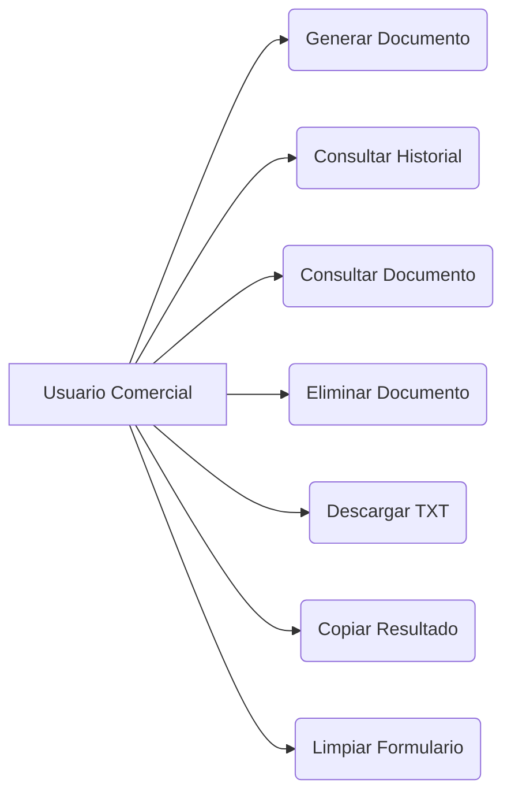

# SPEC-04 — Use Cases

**Proyecto:** AI Sales Assistant – Intelligent Commercial Assistant

**Versión:** 1.0

**Estado:** Draft

**Autor:** Luciana Pinheiro

**Metodología:** Spec-Driven Development (SDD)

---

# 1. Objetivo

Este documento describe los casos de uso funcionales del sistema AI Sales Assistant.

Los casos de uso representan las interacciones entre los actores y la aplicación, definiendo el comportamiento esperado desde el punto de vista del usuario.

---

# 2. Actores

## Actor Principal

**Usuario Comercial**

Persona que utiliza la aplicación para generar contenido comercial mediante Inteligencia Artificial.

---

## Actores Secundarios

### Servicio de IA

Proveedor encargado de generar el contenido solicitado.

Ejemplos futuros:

* OpenAI
* Ollama
* Hugging Face

---

### Base de Datos

Sistema encargado de almacenar el historial de generaciones.

---

# 3. Lista de Casos de Uso

| ID     | Caso de Uso          | Actor   |
| ------ | -------------------- | ------- |
| UC-001 | Generar documento    | Usuario |
| UC-002 | Consultar historial  | Usuario |
| UC-003 | Consultar generación | Usuario |
| UC-004 | Eliminar generación  | Usuario |
| UC-005 | Descargar documento  | Usuario |
| UC-006 | Copiar documento     | Usuario |
| UC-007 | Limpiar formulario   | Usuario |

---

# UC-001 — Generar Documento

## Descripción

Permite generar un documento comercial mediante Inteligencia Artificial.

---

## Actor

Usuario Comercial

---

## Precondiciones

* La aplicación está disponible.
* El usuario ha completado el formulario.
* Existe conexión con el proveedor de IA.

---

## Flujo Principal

1. El usuario abre la aplicación.
2. Introduce los datos del cliente.
3. Selecciona el tipo de documento.
4. Selecciona idioma.
5. Selecciona tono.
6. Pulsa **Generate**.
7. El sistema valida la información.
8. Construye el prompt.
9. Envía la solicitud al modelo de IA.
10. Recibe la respuesta.
11. Guarda el resultado en la base de datos.
12. Muestra el documento generado.

---

## Flujo Alternativo A1

Campos obligatorios vacíos.

Resultado:

El sistema informa de los errores de validación y no realiza la generación.

---

## Flujo Alternativo A2

Error del proveedor de IA.

Resultado:

El sistema muestra un mensaje de error y registra la incidencia mediante logging.

---

## Postcondiciones

* El documento queda almacenado.
* El historial se actualiza.

---

# UC-002 — Consultar Historial

## Descripción

Permite visualizar todas las generaciones realizadas anteriormente.

---

## Flujo Principal

1. El usuario accede al historial.
2. El sistema consulta la base de datos.
3. Se muestran las generaciones ordenadas por fecha descendente.

---

## Postcondiciones

El usuario puede seleccionar una generación.

---

# UC-003 — Consultar una Generación

## Descripción

Permite visualizar un documento concreto.

---

## Flujo Principal

1. El usuario selecciona un registro.
2. El sistema recupera el documento.
3. Se muestran todos los detalles.

---

# UC-004 — Eliminar Generación

## Descripción

Permite eliminar un documento del historial.

---

## Flujo Principal

1. El usuario selecciona un registro.
2. Pulsa **Eliminar**.
3. El sistema solicita confirmación.
4. El documento se elimina.
5. El historial se actualiza.

---

## Flujo Alternativo

El documento no existe.

Resultado:

Se devuelve un error 404.

---

# UC-005 — Descargar Documento

## Descripción

Permite descargar el contenido generado.

---

## Flujo Principal

1. El usuario pulsa **Download TXT**.
2. El sistema genera un archivo de texto.
3. El navegador inicia la descarga.

---

# UC-006 — Copiar Documento

## Descripción

Permite copiar el contenido generado al portapapeles.

---

## Flujo Principal

1. El usuario pulsa **Copy**.
2. El sistema copia el contenido.
3. Se muestra un mensaje de confirmación.

---

# UC-007 — Limpiar Formulario

## Descripción

Permite restablecer todos los campos del formulario.

---

## Flujo Principal

1. El usuario pulsa **Clear**.
2. El formulario vuelve a su estado inicial.
3. El área de resultados queda vacía.

---

# 4. Diagrama General de Casos de Uso

---

# 5. Prioridad de Casos de Uso

| Caso de Uso         | Prioridad |
| ------------------- | --------- |
| Generar Documento   | Alta      |
| Guardar Historial   | Alta      |
| Consultar Historial | Alta      |
| Consultar Documento | Media     |
| Descargar TXT       | Media     |
| Copiar Resultado    | Media     |
| Limpiar Formulario  | Baja      |

---

# 6. Dependencias

| Caso de Uso         | Depende de    |
| ------------------- | ------------- |
| Consultar Historial | Base de Datos |
| Consultar Documento | Historial     |
| Eliminar Documento  | Historial     |
| Descargar Documento | Generación    |
| Copiar Documento    | Generación    |

---

# 7. Reglas de Negocio Relacionadas

* Todo documento generado debe almacenarse automáticamente.
* Solo pueden descargarse documentos existentes.
* Solo pueden eliminarse registros válidos.
* La generación requiere todos los campos obligatorios.
* El historial se ordenará por fecha de creación descendente.

---

# 8. Futuras Ampliaciones

En versiones posteriores se incorporarán nuevos casos de uso:

* Inicio de sesión.
* Gestión de usuarios.
* Favoritos.
* Etiquetas.
* Exportación PDF.
* Exportación Word.
* Compartir documento.
* Generación por voz.
* Integración con CRM.
* Integración con Odoo.
* RAG.
* Multi-Agent Systems.

---

# 9. Resumen

Los casos de uso definidos en este documento representan la funcionalidad principal de la versión 1 del AI Sales Assistant y servirán como base para el diseño del modelo de dominio, la base de datos y la API REST en los siguientes documentos de especificación.
