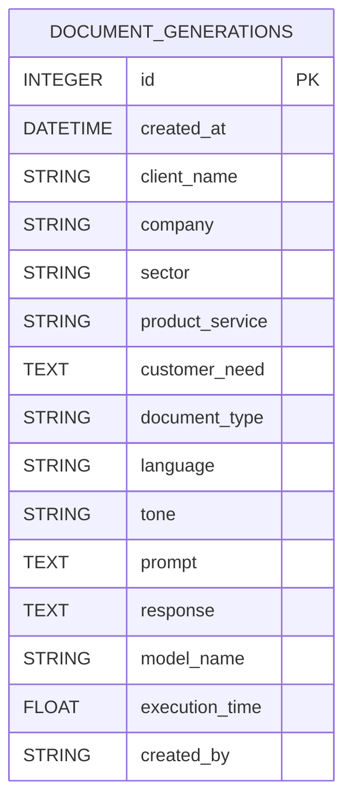
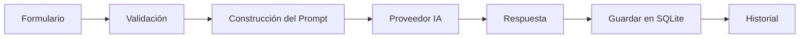

# SPEC-06 — Database Design

**Proyecto:** AI Sales Assistant – Intelligent Commercial Assistant

**Versión:** 1.0

**Estado:** Draft

**Autor:** Luciana Pinheiro

**Metodología:** Spec-Driven Development (SDD)

---

# 1. Objetivo

Este documento define el diseño de la base de datos para la versión 1 del proyecto AI Sales Assistant.

El objetivo es disponer de un modelo sencillo, normalizado y fácilmente escalable que permita evolucionar hacia PostgreSQL sin modificar la lógica de negocio.

---

# 2. Tecnología

## Base de datos inicial

* SQLite

## Futuras versiones

* PostgreSQL
* Redis (caché)
* Vector Database (RAG)

---

# 3. Principios de diseño

Durante el diseño se aplicarán los siguientes principios:

* Normalización (3FN)
* Simplicidad
* Escalabilidad
* Independencia del proveedor de base de datos
* Compatibilidad con SQLAlchemy ORM

---

# 4. Modelo de Datos (Versión 1)

En la primera versión se utilizará una única tabla principal denominada **document_generations**.

Esta tabla almacenará toda la información necesaria para reconstruir una generación realizada por la IA.

---

# 5. Tabla: document_generations

| Campo           | Tipo        | Nulo | Descripción              |
| --------------- | ----------- | ---- | ------------------------ |
| id              | Integer     | No   | Clave primaria           |
| created_at      | DateTime    | No   | Fecha de generación      |
| client_name     | String(100) | No   | Nombre del cliente       |
| company         | String(100) | No   | Empresa                  |
| sector          | String(80)  | No   | Sector empresarial       |
| product_service | String(150) | No   | Producto o servicio      |
| customer_need   | Text        | No   | Necesidad del cliente    |
| document_type   | String(30)  | No   | Tipo de documento        |
| language        | String(10)  | No   | Idioma                   |
| tone            | String(30)  | No   | Tono                     |
| prompt          | Text        | No   | Prompt enviado al modelo |
| response        | Text        | No   | Respuesta generada       |
| model_name      | String(50)  | Sí   | Modelo utilizado         |
| execution_time  | Float       | Sí   | Tiempo de respuesta      |
| created_by      | String(50)  | Sí   | Usuario (futuro)         |

---

# 6. Clave Primaria

```text
id
```

Será autoincremental y única.

---

# 7. Índices

Se crearán índices para mejorar el rendimiento de las consultas.

| Campo         | Motivo                   |
| ------------- | ------------------------ |
| created_at    | Ordenación del historial |
| client_name   | Búsqueda por cliente     |
| company       | Búsqueda por empresa     |
| document_type | Filtrado                 |
| language      | Filtrado                 |

---

# 8. Restricciones

## DBR-001

Todos los campos obligatorios deberán contener información.

---

## DBR-002

El campo **document_type** deberá contener únicamente valores válidos.

---

## DBR-003

El campo **language** deberá contener únicamente idiomas soportados.

---

## DBR-004

El campo **tone** deberá contener únicamente tonos soportados.

---

## DBR-005

La fecha de creación será asignada automáticamente por el sistema.

---

# 9. Enumeraciones

## DocumentType

* EMAIL
* PROPOSAL
* FOLLOW_UP
* WHATSAPP
* SUMMARY

---

## Language

* ES
* EN
* PT

---

## Tone

* PROFESSIONAL
* FORMAL
* FRIENDLY
* PERSUASIVE
* CASUAL

---

# 10. Diagrama Entidad-Relación (ERD)



---

# 11. Flujo de Persistencia



---

# 12. Preparación para futuras versiones

En futuras versiones el modelo evolucionará hacia varias tablas independientes.

Ejemplo:

* users
* organizations
* customers
* products
* prompts
* templates
* document_generations
* conversations
* embeddings
* knowledge_base
* ai_agents

La lógica de negocio no deberá modificarse gracias a la utilización del Repository Pattern.

---

# 13. Compatibilidad con SQLAlchemy

Cada tabla tendrá:

* Modelo ORM
* Repository
* Schema Pydantic
* Migraciones Alembic

---

# 14. Compatibilidad con Alembic

Todas las modificaciones del esquema deberán realizarse mediante migraciones versionadas.

No se permitirán modificaciones manuales de la estructura de la base de datos.

---

# 15. Futuro PostgreSQL

La arquitectura permitirá sustituir SQLite por PostgreSQL modificando únicamente la configuración de conexión.

No será necesario modificar:

* Services
* Routers
* API
* Prompt Engine
* Frontend

---

# 16. Resumen

La versión 1 utilizará una única tabla optimizada para simplificar el desarrollo inicial y reducir la complejidad.

La arquitectura permitirá evolucionar progresivamente hacia un modelo relacional más avanzado conforme se incorporen nuevas funcionalidades como usuarios, organizaciones, RAG, agentes de IA e integraciones con sistemas externos.

Este diseño mantiene el equilibrio entre simplicidad, mantenibilidad y escalabilidad, sirviendo como base para los modelos SQLAlchemy y las migraciones con Alembic.
