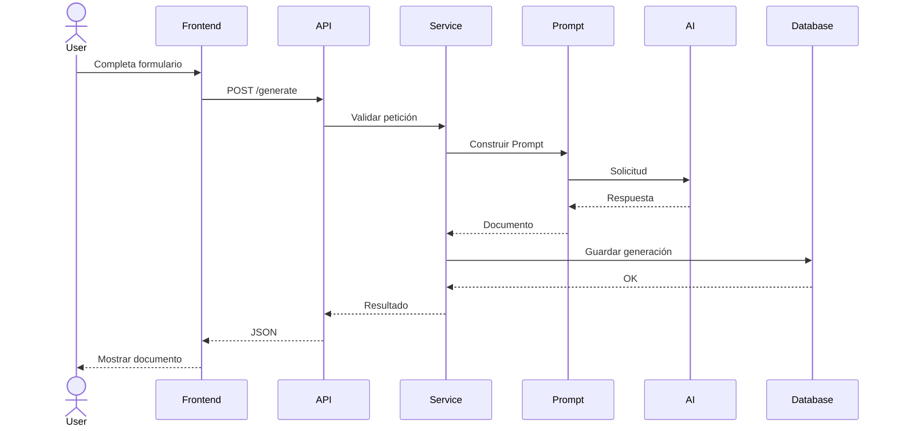

# SPEC-07 — API Design

**Proyecto:** AI Sales Assistant – Intelligent Commercial Assistant

**Versión:** 1.0

**Estado:** Draft

**Autor:** Luciana Pinheiro

**Metodología:** Spec-Driven Development (SDD)

---

# 1. Objetivo

Este documento define el diseño de la API REST del proyecto AI Sales Assistant.

La API seguirá principios RESTful y servirá como interfaz entre el frontend y la lógica de negocio.

La documentación será generada automáticamente mediante OpenAPI y Swagger gracias a FastAPI.

---

# 2. Principios de Diseño

La API deberá cumplir los siguientes principios:

* RESTful
* Stateless
* JSON como formato principal
* Validación automática mediante Pydantic
* Códigos HTTP adecuados
* Documentación OpenAPI
* Compatibilidad futura con JWT

---

# 3. URL Base

Versión inicial:

```text
/api/v1
```

Ejemplos:

```text
/api/v1/generate
/api/v1/history
/api/v1/documents
```

---

# 4. Endpoints

## POST /generate

### Descripción

Genera un documento utilizando Inteligencia Artificial.

---

### Request

```json
{
  "client_name": "Juan Pérez",
  "company": "Tech Solutions",
  "sector": "Tecnología",
  "product_service": "ERP",
  "customer_need": "Automatizar procesos",
  "document_type": "EMAIL",
  "language": "ES",
  "tone": "PROFESSIONAL"
}
```

---

### Response (200)

```json
{
  "id": 1,
  "created_at": "2026-06-26T18:00:00",
  "document_type": "EMAIL",
  "response": "Estimado cliente..."
}
```

---

### Posibles errores

| Código | Descripción               |
| ------ | ------------------------- |
| 400    | Datos inválidos           |
| 422    | Error de validación       |
| 500    | Error interno             |
| 503    | Servicio IA no disponible |

---

## GET /history

### Descripción

Obtiene el historial completo de generaciones.

---

### Response

```json
[
  {
    "id": 1,
    "client_name": "Juan Pérez",
    "company": "Tech Solutions",
    "document_type": "EMAIL",
    "created_at": "2026-06-26T18:00:00"
  }
]
```

---

## GET /history/{id}

### Descripción

Obtiene una generación concreta.

---

### Response

```json
{
  "id": 1,
  "client_name": "Juan Pérez",
  "company": "Tech Solutions",
  "response": "Estimado cliente..."
}
```

---

### Errores

| Código | Significado             |
| ------ | ----------------------- |
| 404    | Documento no encontrado |

---

## DELETE /history/{id}

### Descripción

Elimina un documento del historial.

---

### Response

```json
{
  "message": "Document deleted successfully."
}
```

---

### Errores

| Código | Significado             |
| ------ | ----------------------- |
| 404    | Documento no encontrado |

---

## GET /documents

### Descripción

Devuelve los tipos de documento disponibles.

---

### Response

```json
[
  "EMAIL",
  "PROPOSAL",
  "FOLLOW_UP",
  "WHATSAPP",
  "SUMMARY"
]
```

---

# 5. Flujo de una petición



---

# 6. Estructura JSON

Todas las respuestas seguirán una estructura consistente.

Respuesta correcta:

```json
{
  "success": true,
  "data": {}
}
```

Respuesta con error:

```json
{
  "success": false,
  "error": {
    "code": 404,
    "message": "Document not found."
  }
}
```

---

# 7. Validaciones

Las validaciones serán realizadas mediante Pydantic.

Ejemplos:

* Campos obligatorios.
* Longitud máxima.
* Enumeraciones válidas.
* Tipos de datos.
* Valores permitidos.

---

# 8. Versionado

La API utilizará versionado desde el inicio.

Versión actual:

```text
/api/v1
```

Ejemplo futuro:

```text
/api/v2
```

Esto permitirá evolucionar la API sin romper la compatibilidad.

---

# 9. Seguridad

La versión 1 no implementará autenticación.

No obstante, la arquitectura quedará preparada para incorporar:

* JWT
* OAuth2
* API Keys

sin modificar los endpoints existentes.

---

# 10. OpenAPI

La documentación será generada automáticamente por FastAPI.

Endpoints disponibles:

```text
/docs
```

Swagger UI.

```text
/redoc
```

ReDoc.

---

# 11. Preparación para futuras versiones

La API permitirá incorporar nuevos endpoints como:

```text
POST /login

POST /users

GET /statistics

GET /dashboard

POST /export/pdf

POST /export/docx

POST /rag/query

POST /agents/chat

POST /crm/odoo
```

---

# 12. Resumen

La API REST constituye la interfaz pública del AI Sales Assistant.

Su diseño sigue principios RESTful, mantiene una estructura consistente de peticiones y respuestas y queda preparada para evolucionar con nuevas funcionalidades sin afectar a los consumidores existentes.

Este documento servirá como referencia para implementar los routers de FastAPI, los schemas Pydantic y la documentación automática mediante OpenAPI.
