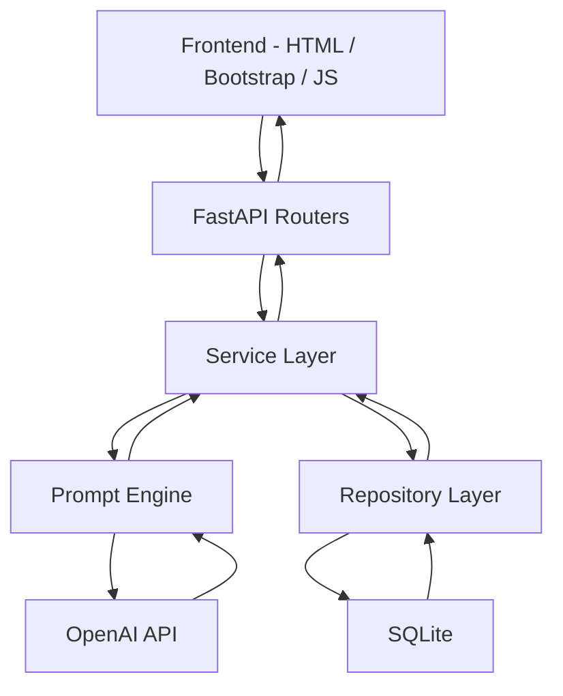
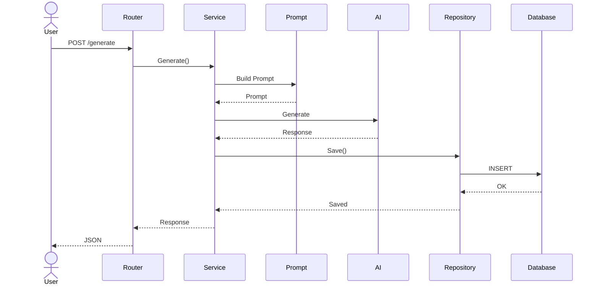
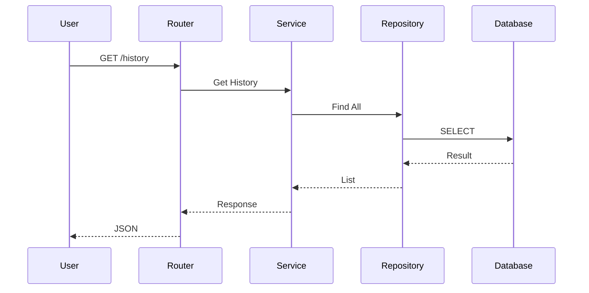

# SPEC-08 — Software Architecture

**Proyecto:** AI Sales Assistant – Intelligent Commercial Assistant

**Versión:** 1.0

**Estado:** Draft

**Autor:** Luciana Pinheiro

**Metodología:** Spec-Driven Development (SDD)

---

# 1. Objetivo

Este documento define la arquitectura del sistema AI Sales Assistant.

El objetivo es construir una aplicación modular, mantenible y escalable siguiendo los principios de Clean Architecture y Separation of Concerns.

La arquitectura permitirá incorporar nuevas funcionalidades sin afectar a la lógica existente.

---

# 2. Principios Arquitectónicos

La arquitectura se basa en los siguientes principios:

* Clean Architecture
* SOLID
* DRY
* KISS
* Separation of Concerns
* Repository Pattern
* Service Layer Pattern
* Dependency Injection (preparada para futuras versiones)

---

# 3. Capas de la Arquitectura

El sistema estará dividido en las siguientes capas:

```text
Presentation Layer
        │
        ▼
API Layer
        │
        ▼
Service Layer
        │
        ▼
Repository Layer
        │
        ▼
Database Layer
```

Cada capa tendrá una única responsabilidad.

---

# 4. Arquitectura General



---

# 5. Componentes

## 5.1 Frontend

Responsabilidades:

* Mostrar la interfaz.
* Recoger datos del usuario.
* Mostrar el contenido generado.
* Consumir la API REST.

Tecnologías:

* HTML5
* Bootstrap 5
* JavaScript
* Jinja2

---

## 5.2 Routers

Responsabilidades:

* Recibir peticiones HTTP.
* Validar la petición mediante Pydantic.
* Delegar la lógica al Service Layer.
* Construir la respuesta HTTP.

Los Routers **no contendrán lógica de negocio**.

---

## 5.3 Service Layer

Responsabilidades:

* Implementar la lógica de negocio.
* Coordinar el proceso de generación.
* Construir el flujo completo de trabajo.
* Gestionar excepciones del dominio.

Esta será la capa más importante del proyecto.

---

## 5.4 Prompt Engine

Responsabilidades:

* Seleccionar la plantilla adecuada.
* Construir el prompt.
* Preparar el contexto para el modelo.
* Mantener separados los prompts del resto del código.

Cada tipo de documento tendrá su propio módulo.

Ejemplo:

```text
prompts/

email_prompt.py

proposal_prompt.py

followup_prompt.py

whatsapp_prompt.py

summary_prompt.py
```

---

## 5.5 Repository Layer

Responsabilidades:

* Acceder a la base de datos.
* Ejecutar operaciones CRUD.
* Ocultar SQLAlchemy al resto de la aplicación.

Los Services nunca accederán directamente a SQLAlchemy.

---

## 5.6 Database

Responsabilidades:

* Persistir la información.
* Recuperar el historial.
* Mantener la integridad de los datos.

Versión 1:

SQLite

Versión futura:

PostgreSQL

---

## 5.7 AI Provider

Responsabilidades:

* Recibir el prompt.
* Generar contenido.
* Devolver la respuesta.

Versión inicial:

OpenAI

Futuro:

* Ollama
* Hugging Face
* Azure OpenAI
* Anthropic
* Gemini

---

# 6. Flujo de Generación



---

# 7. Flujo de Consulta



---

# 8. Dependencias

Las dependencias siempre apuntarán hacia el interior de la arquitectura.

```text
Frontend

↓

Routers

↓

Services

↓

Repositories

↓

Database
```

Nunca al revés.

---

# 9. Responsabilidades por Carpeta

| Carpeta      | Responsabilidad         |
| ------------ | ----------------------- |
| routers      | Endpoints HTTP          |
| services     | Lógica de negocio       |
| repositories | Acceso a datos          |
| prompts      | Prompt Engineering      |
| models       | SQLAlchemy ORM          |
| schemas      | Modelos Pydantic        |
| database     | Configuración BD        |
| config       | Variables de entorno    |
| core         | Componentes compartidos |
| templates    | Vistas Jinja2           |
| static       | CSS, JS e imágenes      |
| utils        | Funciones auxiliares    |

---

# 10. Principios SOLID

La arquitectura se diseñará siguiendo los cinco principios SOLID:

* Single Responsibility Principle
* Open/Closed Principle
* Liskov Substitution Principle
* Interface Segregation Principle
* Dependency Inversion Principle

---

# 11. Escalabilidad

La arquitectura permitirá incorporar:

* PostgreSQL
* Redis
* JWT
* Docker
* Kubernetes
* RAG
* MCP
* Multi-Agent Systems
* Odoo CRM

sin modificar la lógica principal.

---

# 12. Ventajas de esta Arquitectura

* Alta mantenibilidad.
* Bajo acoplamiento.
* Alta cohesión.
* Fácil de probar mediante pytest.
* Escalable.
* Preparada para IA y automatización.
* Preparada para microservicios en el futuro.

---

# 13. Futuras Evoluciones

En versiones posteriores podrán añadirse nuevos componentes como:

* Authentication Service
* Notification Service
* Dashboard Service
* RAG Service
* Agent Orchestrator
* MCP Client
* Cache Layer (Redis)

sin afectar a las capas existentes.

---

# 14. Resumen

La arquitectura del AI Sales Assistant sigue un enfoque modular basado en Clean Architecture.

Cada componente tiene una responsabilidad claramente definida y se comunica únicamente con la capa inmediatamente inferior.

Este diseño facilita el mantenimiento, las pruebas automatizadas y la evolución del proyecto, permitiendo incorporar nuevas tecnologías y funcionalidades sin reescribir la lógica de negocio.
