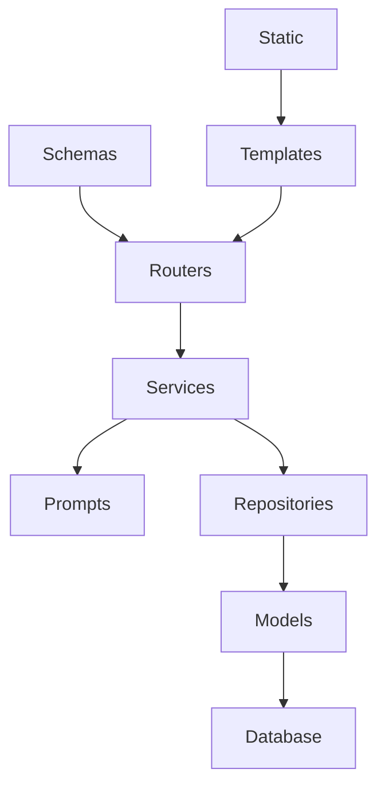

# SPEC-09 — Folder Structure

**Proyecto:** AI Sales Assistant – Intelligent Commercial Assistant

**Versión:** 1.0

**Estado:** Draft

**Autor:** Luciana Pinheiro

**Metodología:** Spec-Driven Development (SDD)

---

# 1. Objetivo

Este documento describe la estructura de carpetas del proyecto AI Sales Assistant.

La organización del código sigue los principios de Clean Architecture y Separation of Concerns, permitiendo que cada componente tenga una única responsabilidad.

El objetivo es facilitar:

* mantenibilidad;
* escalabilidad;
* reutilización;
* incorporación de nuevos desarrolladores;
* evolución futura del sistema.

---

# 2. Estructura General

```text
ai-sales-assistant/

│
├── app/
│
├── docs/
│
├── tests/
│
├── alembic/
│
├── docker/
│
├── requirements/
│
│
├── .env
├── .env.example
├── .gitignore
├── Dockerfile
├── docker-compose.yml
├── pyproject.toml
├── README.md
└── LICENSE
```

---

# 3. Carpeta app/

Contiene todo el código fuente de la aplicación.

```text
app/

├── api/
├── routers/
├── services/
├── repositories/
├── prompts/
├── models/
├── schemas/
├── database/
├── config/
├── core/
├── templates/
├── static/
├── utils/
└── main.py
```

---

# 4. api/

## Responsabilidad

Punto de entrada de la API.

En futuras versiones podrá incluir:

* versionado
* middleware
* dependencias
* configuración de rutas

Ejemplo:

```text
api/

v1.py

dependencies.py

middleware.py
```

---

# 5. routers/

## Responsabilidad

Define los endpoints HTTP.

No contendrá lógica de negocio.

Ejemplo:

```text
routers/

generate.py

history.py

documents.py
```

Responsabilidades:

* recibir peticiones
* devolver respuestas
* validar entrada
* llamar al Service Layer

---

# 6. services/

Es la capa más importante del proyecto.

Contiene toda la lógica de negocio.

Ejemplo:

```text
services/

generation_service.py

history_service.py
```

Responsabilidades:

* coordinar operaciones
* construir flujos
* gestionar reglas de negocio
* utilizar repositories
* utilizar prompts

---

# 7. repositories/

Responsables del acceso a datos.

Nunca contendrán lógica de negocio.

Ejemplo:

```text
repositories/

generation_repository.py
```

Responsabilidades:

* INSERT
* UPDATE
* DELETE
* SELECT

---

# 8. prompts/

Contendrá los prompts utilizados por la IA.

Ejemplo:

```text
prompts/

email_prompt.py

proposal_prompt.py

followup_prompt.py

whatsapp_prompt.py

summary_prompt.py
```

Cada prompt será independiente.

Esto facilitará:

* mantenimiento
* reutilización
* pruebas
* Prompt Engineering

---

# 9. models/

Modelos ORM de SQLAlchemy.

Ejemplo:

```text
models/

generation.py
```

Cada clase representará una tabla de la base de datos.

---

# 10. schemas/

Modelos Pydantic.

Separados completamente de SQLAlchemy.

Ejemplo:

```text
schemas/

generation.py

request.py

response.py
```

Responsabilidades:

* validación
* serialización
* documentación OpenAPI

---

# 11. database/

Configuración de la base de datos.

Ejemplo:

```text
database/

session.py

base.py
```

Responsabilidades:

* conexión
* Session
* Engine
* Base ORM

---

# 12. config/

Configuración global.

Ejemplo:

```text
config/

settings.py
```

Aquí se utilizará Pydantic Settings.

Nunca se escribirán claves API dentro del código.

---

# 13. core/

Componentes compartidos por toda la aplicación.

Ejemplo:

```text
core/

exceptions.py

logging.py

constants.py

security.py
```

---

# 14. templates/

Plantillas HTML.

Ejemplo:

```text
templates/

index.html

history.html
```

---

# 15. static/

Archivos estáticos.

Ejemplo:

```text
static/

css/

js/

img/
```

---

# 16. utils/

Funciones auxiliares reutilizables.

Ejemplo:

```text
utils/

helpers.py

validators.py

formatters.py
```

No contendrán lógica de negocio.

---

# 17. tests/

Pruebas automatizadas.

```text
tests/

test_api.py

test_services.py

test_repository.py

test_prompts.py
```

Se utilizará:

* pytest

---

# 18. docs/

Documentación del proyecto.

```text
docs/

specs/

diagrams/

adr/

images/
```

Aquí se almacenarán:

* especificaciones
* diagramas
* ADR
* documentación técnica

---

# 19. alembic/

Migraciones de base de datos.

Todas las modificaciones del esquema deberán realizarse mediante Alembic.

---

# 20. docker/

Archivos relacionados con Docker.

Ejemplo:

```text
docker/

nginx/

scripts/
```

---

# 21. requirements/

Dependencias del proyecto.

Ejemplo:

```text
requirements/

base.txt

dev.txt

prod.txt
```

---

# 22. Archivos raíz

## README.md

Presentación del proyecto.

---

## Dockerfile

Construcción de la imagen Docker.

---

## docker-compose.yml

Orquestación de servicios.

---

## pyproject.toml

Configuración de herramientas como:

* Black
* Ruff
* MyPy
* Pytest

---

## .env

Configuración local.

---

## .env.example

Plantilla de configuración para otros desarrolladores.

---

## .gitignore

Archivos excluidos del control de versiones.

---

# 23. Dependencias entre Carpetas



---

# 24. Reglas de Organización

Durante el desarrollo se deberán respetar las siguientes normas:

* Un archivo debe tener una única responsabilidad.
* Los routers nunca accederán directamente a la base de datos.
* Los repositories nunca conocerán la API.
* Los prompts estarán aislados del resto del sistema.
* Las configuraciones estarán centralizadas.
* Todo módulo deberá ser fácilmente testeable.

---

# 25. Evolución futura

La estructura permitirá incorporar nuevas carpetas como:

```text
agents/

rag/

cache/

workers/

notifications/

integrations/

odoo/

crm/

analytics/
```

sin afectar a la organización existente.

---

# 26. Resumen

La estructura de carpetas del AI Sales Assistant está diseñada para mantener una clara separación de responsabilidades, facilitar el mantenimiento y permitir el crecimiento del proyecto.

Cada componente tiene un propósito bien definido, siguiendo buenas prácticas de arquitectura y preparando la aplicación para futuras integraciones con IA, RAG, ERP, CRM y sistemas distribuidos.
