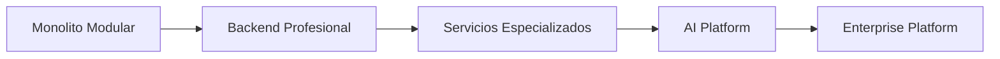

# SPEC-10 — Project Roadmap

**Proyecto:** AI Sales Assistant – Intelligent Commercial Assistant

**Versión:** 1.0

**Estado:** Draft

**Autor:** Luciana Pinheiro

**Metodología:** Spec-Driven Development (SDD)

---

# 1. Objetivo

Este documento define el roadmap del proyecto AI Sales Assistant.

El objetivo es planificar la evolución del sistema mediante versiones incrementales, garantizando un crecimiento ordenado, mantenible y alineado con los principios de arquitectura definidos en las especificaciones anteriores.

---

# 2. Visión del Proyecto

AI Sales Assistant aspira a convertirse en una plataforma inteligente de automatización comercial basada en Inteligencia Artificial.

La versión inicial cubrirá la generación de contenido comercial, mientras que las siguientes versiones incorporarán nuevas capacidades relacionadas con IA, automatización, analítica y sistemas empresariales.

---

# 3. Roadmap General

```text id="sxjlwm"
V1 → MVP
V2 → Backend Profesional
V3 → Plataforma Comercial
V4 → AI Platform
V5 → Enterprise AI Assistant
```

---

# 4. Versión 1 — MVP

## Objetivos

Desarrollar una aplicación funcional con arquitectura profesional.

### Funcionalidades

* Generación de documentos mediante IA.
* Historial de generaciones.
* API REST.
* Frontend con Bootstrap.
* SQLite.
* Swagger/OpenAPI.
* Prompt Engineering.
* Documentación SDD.

### Tecnologías

* Python
* FastAPI
* SQLAlchemy
* Pydantic
* Alembic
* SQLite
* Bootstrap
* Jinja2

---

# 5. Versión 2 — Backend Profesional

## Objetivos

Mejorar la infraestructura y preparar el proyecto para producción.

### Funcionalidades

* PostgreSQL.
* Docker.
* Docker Compose.
* Variables de entorno.
* Logging avanzado.
* Gestión de usuarios.
* JWT.
* Roles y permisos.
* Refresh Tokens.

### Tecnologías

* PostgreSQL
* Docker
* Docker Compose
* JWT
* Passlib
* Python Logging

---

# 6. Versión 3 — Plataforma Comercial

## Objetivos

Convertir el sistema en una herramienta comercial completa.

### Funcionalidades

* Dashboard.
* Estadísticas.
* Exportación PDF.
* Exportación Word.
* Búsquedas.
* Filtros.
* Favoritos.
* Plantillas reutilizables.
* Gestión de clientes.

### Tecnologías

* Chart.js
* WeasyPrint
* python-docx

---

# 7. Versión 4 — AI Platform

## Objetivos

Incorporar capacidades avanzadas de Inteligencia Artificial.

### Funcionalidades

* RAG.
* Embeddings.
* Base de conocimiento.
* Chat IA.
* Ollama.
* Hugging Face.
* Modelos locales.
* Selección dinámica de modelos.

### Tecnologías

* LangChain
* Ollama
* Hugging Face
* ChromaDB (o similar)
* Sentence Transformers

---

# 8. Versión 5 — Enterprise AI Assistant

## Objetivos

Integrar el sistema con plataformas empresariales.

### Funcionalidades

* Odoo CRM.
* Salesforce.
* HubSpot.
* APIs REST externas.
* Automatización comercial.
* Workflows.
* MCP.
* Multi-Agent Systems.

### Tecnologías

* MCP
* Odoo API
* REST APIs
* Webhooks

---

# 9. Evolución de la Arquitectura



---

# 10. Evolución de la Base de Datos

```mermaid id="qjlwm6"
flowchart LR

SQLite

-->

PostgreSQL

-->

Redis

-->

Vector Database

-->

Data Warehouse
```

---

# 11. Evolución de la IA

```mermaid id="8jlwm7"
flowchart LR

OpenAI

-->

Multi Provider

-->

RAG

-->

Agents

-->

Multi-Agent Systems
```

---

# 12. Integraciones Futuras

La arquitectura estará preparada para integrar:

## ERP

* Odoo
* SAP
* Microsoft Dynamics

---

## CRM

* HubSpot
* Salesforce
* Zoho CRM

---

## IA

* OpenAI
* Ollama
* Hugging Face
* Azure OpenAI
* Anthropic
* Gemini

---

## Automatización

* n8n
* Make
* Zapier

---

## Comunicación

* WhatsApp Business
* Microsoft Teams
* Slack
* Gmail

---

# 13. Calidad del Proyecto

En todas las versiones se mantendrán los siguientes principios:

* Clean Architecture.
* SOLID.
* DRY.
* Tipado completo.
* Logging.
* Testing.
* Documentación.
* CI/CD.

---

# 14. Objetivos Formativos

Este proyecto permitirá adquirir experiencia práctica en:

* FastAPI.
* SQLAlchemy.
* Docker.
* PostgreSQL.
* Redis.
* Prompt Engineering.
* AI Software Engineering.
* RAG.
* MCP.
* Multi-Agent Systems.
* Arquitectura de Software.
* APIs REST.
* Testing.
* DevOps.

---

# 15. Objetivos para el Portfolio

Al finalizar el proyecto será posible demostrar conocimientos en:

* Diseño de software.
* Arquitectura limpia.
* Desarrollo Backend.
* Integración con IA.
* Diseño de APIs REST.
* Modelado de datos.
* Ingeniería de Prompts.
* Documentación técnica.
* Desarrollo dirigido por especificaciones (SDD).

---

# 16. Objetivos Profesionales

El proyecto servirá como evidencia técnica para optar a posiciones como:

* AI Software Engineer.
* Backend Python Developer.
* FastAPI Developer.
* AI Automation Engineer.
* Full Stack Python Developer.
* Technical Consultant.
* Software Engineer.

---

# 17. Criterios de Finalización

El proyecto se considerará completo cuando:

* Todas las funcionalidades de la versión 1 estén implementadas.
* La documentación esté actualizada.
* Existan pruebas automatizadas.
* El proyecto pueda ejecutarse mediante Docker Compose.
* Se encuentre publicado en GitHub.
* Disponga de un README profesional.
* Sea desplegable en un entorno cloud.

---

# 18. Resumen

El roadmap establece una evolución progresiva del AI Sales Assistant desde un MVP bien diseñado hasta una plataforma empresarial basada en Inteligencia Artificial.

Cada versión incorpora nuevas capacidades sin comprometer la arquitectura inicial, permitiendo un crecimiento sostenible y alineado con las mejores prácticas de ingeniería de software.

El objetivo final es disponer de un proyecto profesional que combine desarrollo backend, integración con IA, arquitectura limpia y documentación de alta calidad, convirtiéndose en una pieza destacada del portfolio técnico.
